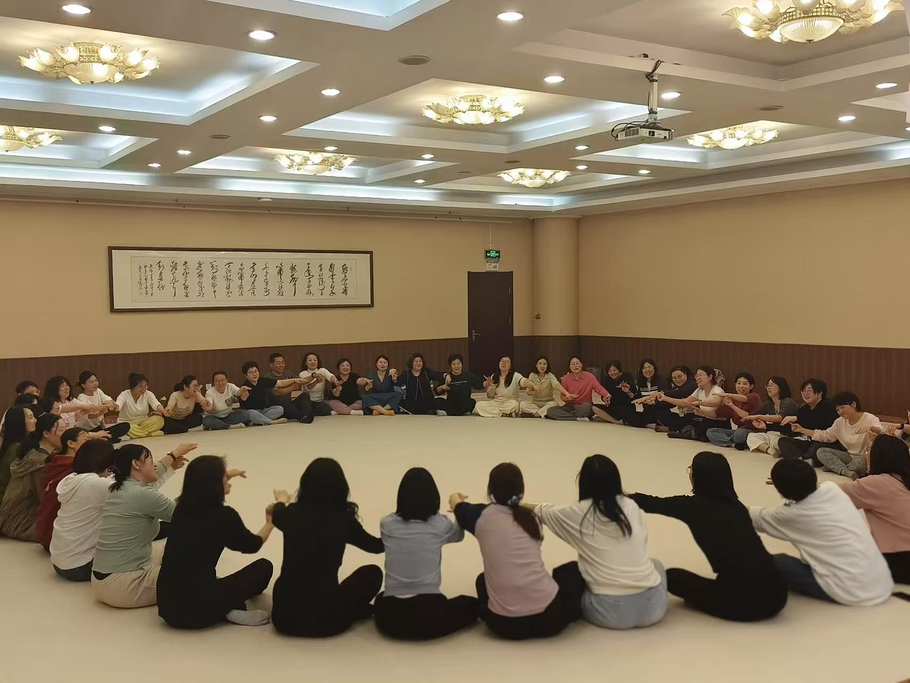

# 正念舞动工作坊 -- 觉知舞者之旅
**主讲人：王平  主办方：赵杰**

---

### 一、工作坊流程  

#### 1. 主办方开场  
- 开场大概用了 5 分钟，赵杰老师的声音很好听，给人一种亲切的感觉。  
- 如果是我开场，会花多点时间介绍主讲人，毕竟，接下来要花两个小时和老师待在一起。

---

#### 2. 王平老师带着大家做舞动  

**✨ 破冰**  
- 简短开场，让大家与左右及最远的人打招呼，发出邀请。  

**🎵 “动—停” 模拟游戏**  
- 播放“动、停”的音乐，老师先演示。  
- 玩法：一个人做动作（领导者），另一个人模仿（跟随者），然后交换角色。

> **June：**在过程中我很享受当下，但我的伙伴大多眼睛看向别处。我知道不是我不重要，而是她们不想和别人不一样。

**🌀 更换搭档后的舞动**  
- 搭档 Emma，放开手脚继续跳舞。  
> **June：**这一次我感觉身体更能打开，更放松了，玩的更 high。  
> **Fancy：**搭档大悦，她完全沉浸在游戏里，这让我也很投入。

**🎣 抓鱼游戏（渔夫与小鱼）**  
- 游戏中两人需要角色互换，渔夫与小鱼交替，很好玩。  
> **June：**这是本场的高潮，老师希望大家静下心来，回到童年的受伤片刻，并抱抱小时候的自己。  
> 很多人在这个练习中哭了。  
> **我感觉自己一直被爱着，一直被支持着。** 我不需要像老师说的那样，做自己的妈妈。

> **关于搭档的感受：**  
> 跟我搭档的小姐姐，看起来很柔弱，但，两个人手对手的时候，她会想带领我走，我可以被带领着，但是她的手太用力了，把我的手稍微有点折回去，让我感到不舒服。在那个场域下，我猜测她是一个有些强势的人。
> 当老师说“把对方当成你的孩子”时，她的手变得温柔，我知道她一定有孩子，并很爱她的孩子。那一刻我希望，作为“孩子”的我，可以被温柔地对待，而不是被推得太用力。

**🌬 静的练习：呼吸与开背**  
- 放慢节奏，打开身体，有种拥抱自己、打开背部的感觉。  
> **June：**这里放的是小调，我稍微有点跑题。

**🗣 情绪释放练习**  
- 排出身体中不好的情绪，用“哈 哈 哈 哈”的声音。  
> **June：**我差点笑场，权当锻炼身体了！

#### 3. 王平老师和赵杰老师总结
- 王平老师：让我们的孩子学会用爱的方式对待自己
- 赵杰老师说的一句话挺触动我的：“作为父母，当我们用爱把自己的心填满，就不会从孩子那索取。”
> **June:**我知道了从小我疑惑的问题，妈妈为什么会不开心。

#### **一个体验过爱的生命会不惧任何风雨**
---

### 三、我的感受  
- 我的童年是快乐的！
- 没有解决不了的问题。  
- 以前我总感觉，自己做的功课一点用不上。但这次上这个治愈课，我全程 80% 的专注，在过程中感到自己很幸福。  
    我知道，这是我平时做的功课起作用了 —— 其实我早已在生活中疗愈了自己。  

**😊 开心。**

